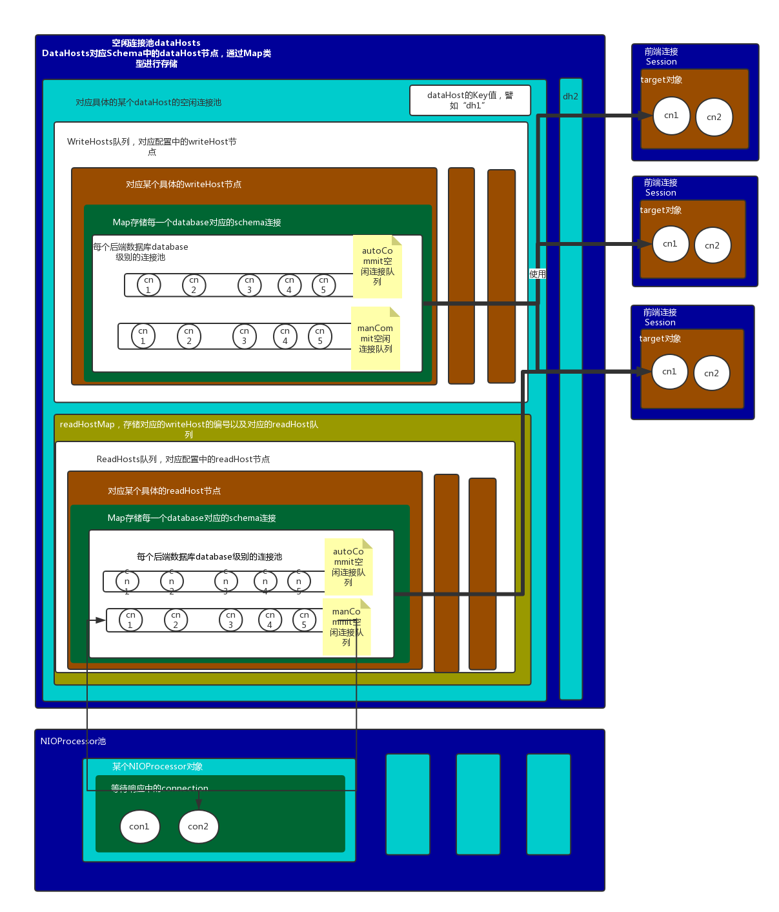
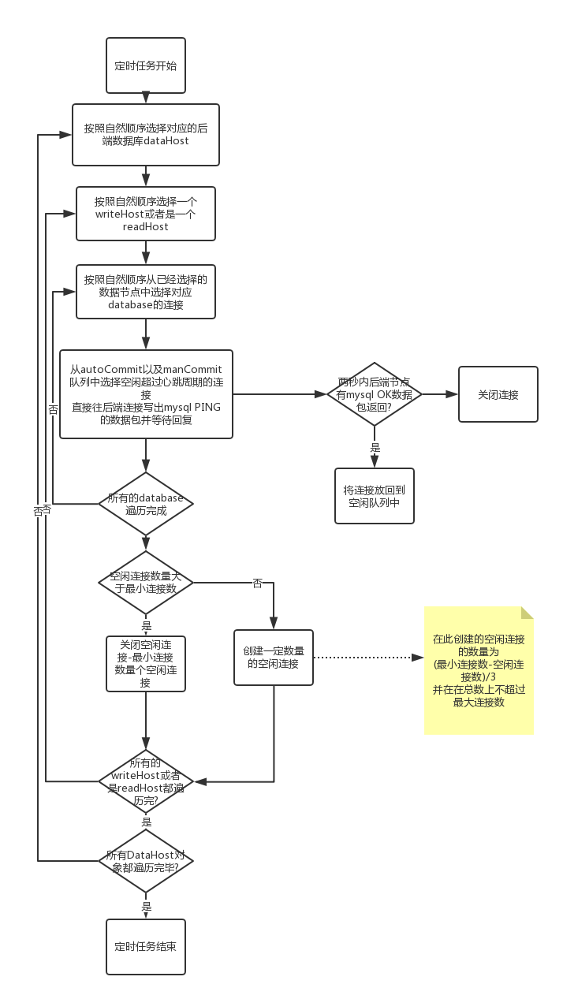

##  2.6 连接池管理

### 2.6.1 Dble后端连接池的存储结构
   Dble的后端连接池基本分为两个部分，一个是在空闲的部分，一个是在等待响应的部分
   在空闲的部分基本结构符合在schema.xml配置文件里面的配置结构，在接近底层融合了配置信息内的dataNode的结构，最终形成面向具体实例具体database的空闲连接队列：
   
   

### 2.6.2 Dble后端连接池的心跳管理
   dble后端节点的管理和心跳是通过定时任务dataNodeConHeartBeatCheck来完成的，此定时任务以server.xml中的dataNodeIdleCheckPeriod配置为周期，定时查看空闲的定时任务
   其流程基本逻辑如下：  
   

1. 遍历所有物理节点对应所有database的空闲连接队列
2. 选取其中的空闲超过一个心跳周期的连接进行心跳
3. 心跳在2S内能得到响应则放回，否则关闭连接
4. 通过最小连接数和当前空闲连接数之前的差值确定需要提前准备空闲连接或者是关闭多余的空闲连接

